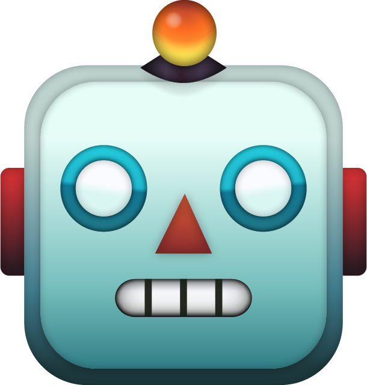

<p align="center"></p>

# Botter

Crossplatform Bot Framework written in Swift 5.3 with Vapor framework unifying [Telegrammer](https://github.com/givip/Telegrammer) and [Vkontakter](https://github.com/CoolONEOfficial/Vkontakter)
[](https://github.com/givip/Telegrammer/releases)
[](https://swift.org/download/)
[](https://swift.org/download/)
[](https://github.com/CoolONEOfficial/Vkontakter/blob/master/LICENSE)


What does it do
---------------

Botter is open-source framework for crossplatform bots developers.
It was built on top of Vapor framework

The simplest code of Echo Bot looks like this:

-------------

_main.swift_

```swift
import Foundation
import Botter
import Vkontakter
import Telegrammer

var vkSettings = Vkontakter.Bot.Settings(token: vkToken)

vkSettings.webhooksConfig = .init(
    ip: "0.0.0.0",
    url: Enviroment.get("VK_BOT_WEBHOOK_URL")!, // or use openUrl(80)
    groupId: UInt64(Enviroment.get("VK_GROUP_ID")!)!
)

var tgSettings = Telegrammer.Bot.Settings(token: tgToken)

let tgPort = Int(Enviroment.get("TG_PORT") ?? "8443")!
 
tgSettings.webhooksConfig = .init(
    ip: "0.0.0.0",
    url: Enviroment.get("TG_WEBHOOK_URL")!, // or use openUrl(tgPort)
    port: tgPort
)

var settings = Bot.Settings(vk: vkSettings, tg: tgSettings)

let bot = try Bot(settings: settings)

let echoHandler = MessageHandler { (update, context) in
		guard case let .message(message) = update.content,
          let text = message.text else { return }

    _ = try bot.getUser(from: update, app: context.app)?.throwingFlatMap { user in
        try message.reply(.init(text: "Hello, \(user.firstName ?? "anonymous")"), context: context)
    }
}

let dispatcher = Dispatcher(bot: bot)
dispatcher.add(handler: echoHandler)

_ = try Updater(bot: bot, dispatcher: dispatcher).startWebhooks(serverName: "testserver")

```

Documentation
---------------

- Read [An official documentation of Vapor](https://docs.vapor.codes/4.0/)

Requirements
---------------

- Ubuntu 16.04 or later with [Swift 5.1 or later](https://swift.org/getting-started/) / macOS with [Xcode 11 or later](https://swift.org/download/)
- Vk account and a Vk App for mobile platform or online (desktop client does not support some chatbot features)
- [Swift Package Manager (SPM)](https://github.com/apple/swift-package-manager/blob/master/Documentation/Usage.md) for dependencies 
- [Vapor 4](https://vapor.codes)

Contributing
---------------

See [CONTRIBUTING.md](CONTRIBUTING.md) file.

Author
---------------

Nikolai Trukhin

[coolone.official@gmail.com](mailto:coolone.official@gmail.com)
[@cooloneofficial](tg://user?id=356008384)